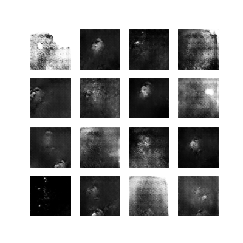
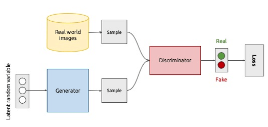
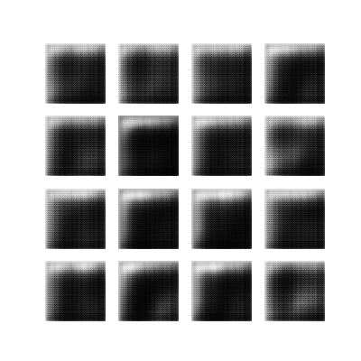
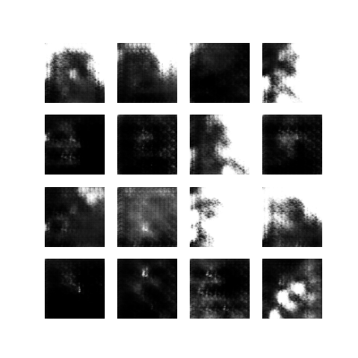
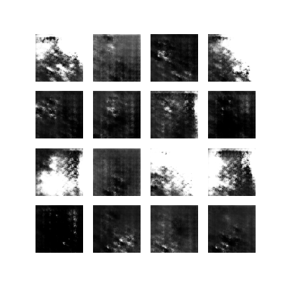
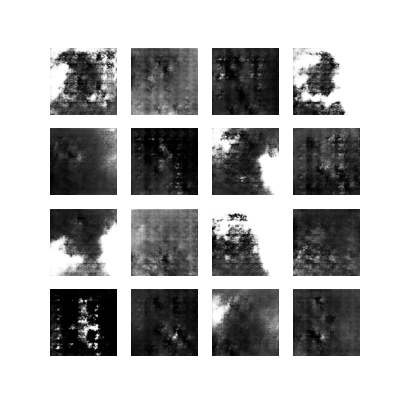
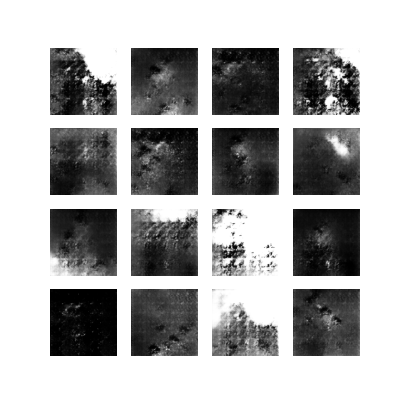
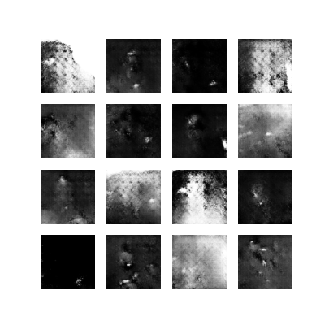
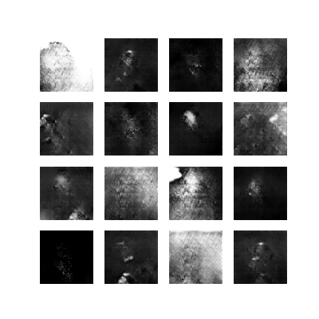
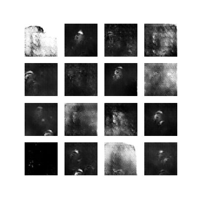

# Portrait GAN - Generate Realistic Portrait Images through Generative Adversarial Networks
<p align="center">
  
</p>

## Overview
This project aims to train Generative Adversarial Networks (GANs) to generate realistic portrait images. GANs are powerful deep learning models capable of generating synthetic data that closely resembles real data. In this project, we leverage GANs to generate diverse and visually appealing portrait images, which can have applications in art generation, data augmentation, and image synthesis.

## Features
- Trained  GAN models on a diverse portrait dataset.
- Used TensorFlow and Keras for implementation.
- Explored hyperparameter tuning, optimization strategies, and model architectures.

## Getting Started
1. Clone the repository:
   ```bash
     git clone https://github.com/bahadurkhan110/portrait_gans.git
   ```


## Dataset
The portrait dataset used in this project consists of diverse images of human faces sourced from various online repositories. The dataset is preprocessed and augmented to improve model generalization and diversity in generated images.

## Methodologies

### Data Preprocessing

- **Data Selection:** The dataset consisted of RGB images with a resolution of 256x256 pixels, carefully chosen to align with the project goals. It contained portrait images capturing diverse facial features and expressions.

- **Data Augmentation:** To enhance dataset variability and robustness, we applied augmentation techniques such as random rotations, flips, and shifts. This prevented overfitting and improved model generalization.

- **Normalization:** Pixel values of the images were normalized to the range [-1, 1] to facilitate training. This step ensured zero mean and unit variance, beneficial for neural network training.

### Model Architecture Design

- **Generator Network:** Designed to transform random noise vectors into realistic images, the generator employed a deep convolutional architecture with multiple layers capturing intricate features and textures.

- **Discriminator Network:** Tasked with distinguishing real from fake images, the discriminator utilized a deep convolutional architecture to learn discriminative features effectively.

- **Network Architecture:** Both networks utilized convolutional neural network (CNN) architectures, chosen for their success in image-related tasks and ability to capture hierarchical features.
<p align="center">
  
</p>

### Training Process

- **Custom Training Loop:** Implemented a custom training loop using TensorFlow for fine-grained control over the process. This enabled defining custom training steps, loss functions, and optimization strategies tailored to the specific GAN models.

- **Loss Functions:** Utilized binary cross-entropy loss for both the generator and discriminator networks, commonly used in GANs to measure the difference between predicted and true labels.

- **Optimization:** Adam optimizer was chosen for training due to its suitability for deep neural networks and fast convergence properties.

- **Training Iterations:** The GANs were trained over approximately 700 epochs, with each epoch contributing to model performance improvement. Despite the time-consuming nature of training, results showed gradual progress and enhancement in generated images.


## License
This project is licensed under the MIT License - see the [LICENSE](LICENSE) file for details.


## Results

After extensive training and experimentation, the trained GAN models demonstrate promising results in generating realistic portrait images. Despite challenges such as mode collapsing and training instability, the models show gradual improvement over time, capturing essential features and patterns present in the dataset.


<p align="center">  
  
  
  
  
</p>
<p align="center">
  
  
  
  
</p>

## Future Directions
- Explore advanced GAN architectures such as Progressive GANs or StyleGAN.
- Refine evaluation metrics and incorporate human perceptual studies for more comprehensive assessment.
- Investigate techniques for handling diverse and complex datasets to improve model performance.
- Experiment with transfer learning and fine-tuning on specific portrait styles or characteristics.

